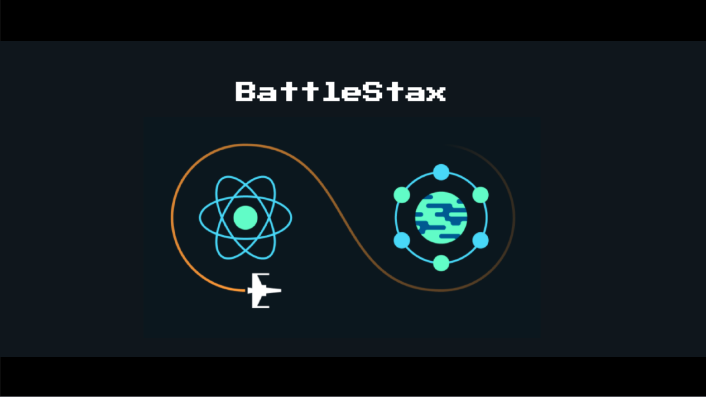
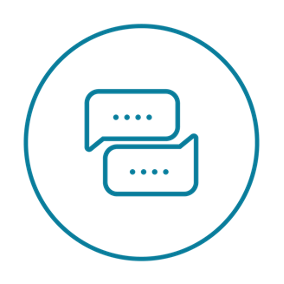

## 🚀 JamStack + 🧑‍🚀 React + 🧑‍💻 Workshop

Welcome to **BattleStax**, a [JAMStack](https://jamstack.org/) game that uses [Netlify](https://www.netlify.com/jamstack/), [DataStax Astra](https://dtsx.io/workshop), and [GitHub](https://github.com/) to demonstrate how to build and deploy an application using modern, scalable architectures. In this 3 hour workshop you will create your own **BattleStax** game using [React](https://reactjs.org/) and [Redux](https://redux.js.org/) implemented with a CI/CD pipeline, global CDN network, and [Apache Cassandra](https://cassandra.apache.org/) all using **FREE** tech.

 

It doesn't matter if you join our workshop live or you prefer to do at your own pace, we have you covered. In this repository, you'll find everything you need for this workshop:

| MATERIALS  | RECORDINGS | CHAT | QUESTIONS
| --- | --- | --- | --- |
|  |  | ) | |

## Table of Contents

1. [Setup environment and tools](./README_step00.md)
2. [Serverless REST API with Netlify](./README_step01.md)
3. [Connect and save data to ASTRA](./README_step02.md)

| Title  | Description
|---|---|
| **00. Setup environment and tools** | [🔥 |
| **01. Create a REST API** | [Create a REST API](./README_step01.md) |
| **02. Connect your Astra database** | [Connect your Astra database](./README_step02.md) |
| **03. Write a function to use REST** | [Write a function to use REST](./README_step03.md) |
| **04. Test your REST function** | [Test your REST function](./README_step04.md) |
| **05. Client state with Redux** | [Client state with Redux](./README_step05.md) |
| **06. Build a slice** | [Build a slice](./README_step06.md) |
| **07. Test your slice** | [Test your slice](./README_step07.md) |
| **08. Create a UI component with React** | [Create a UI component with React](./README_step07.md) |
| **09. Create a storybook** | [Create a storybook](./README_step08.md) |
| **10. Test a React component** | [Test a React component](./README_step09.md) |
| **11. Add a hook** | [Add a hook](./README_step10.md) |
| **12. Deploy your completed application** | [Deploy your completed application](./README_step12.md) |
| **12. Challenge your friends to a game** | [Challenge your friends to a game](./README_step13.md) |

## Project Structure

BattleStax's folder structure is (mostly) generated from [Create React App](https://github.com/facebook/create-react-app). We then add a Netlify Functions and Github Actions.

- .github - [Github Actions](https://github.com/features/actions) configuration
- .storybook - [Storybook Documentation](https://storybook.js.org/) Storybook configuration
- functions - [Netlify Functions](https://www.netlify.com/products/functions/) Lambda function definition
- public - Static files
- src - [create-react-app](https://github.com/facebook/create-react-app) source files

### Prerequisites

-  A Github account - [Github](https://github.com)
-  A fork of the `BattleStax Tutorial` repository - [Repository](https://github.com/kidrecursive/battlestax-tutorial)
- Environment (choose one)
    - **GitPod:** A free, cloud based IDE in **GitHub** which we preconfigure for you (seriously, this is cool)
    - **Local:** NodeJS 12 - [Download](https://nodejs.org/en/download/) - Recommended alternative: Setup your local development environment with [nodeenv](#nodeenv)
-  A Netlify account (it's free!) - [Netlify](https://www.netlify.com)
-  An Astra account and database (it's free!) - [Astra](https://dtsx.io/workshop)

To get started, use the table of contents and start with **`00. Setup environment and tools`** listed below. You **MUST** complete this step in order to get your enviroment configured for the rest of the workshop. Once that is complete you are free to start from any other step.