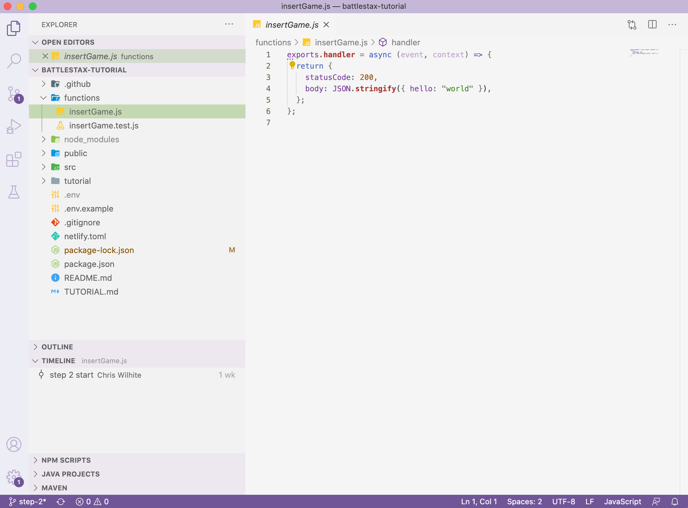

# 01. Create a mock REST API with Netlify functions

[](http://www.apache.org/licenses/LICENSE-2.0)
[](https://discord.com/widget?id=685554030159593522&theme=dark)
[](https://github.com/DataStax-Academy/battlestax/actions) 
[](https://app.netlify.com/sites/battlestax-tutorial/deploys)

[🏠 Back to [Table of Contents](./README.md#table-of-contents)]

* [Part1 - [Setup environment and tools](./README_step00.md)]

## Objectives

```diff
+ The REST API is stateless, and therefore helps functions scale horizontally. 

In step 2 of the Battlestax tutorial, we will:

+ Create test cases to check that our API call is working correctly
 
+ Build the API call to Astra to create a game document, based on the requirements from our test
```

## 1. Setup your environment

**✅ Step 1a: Checkout expected branch**

1. Switch to branch `step-2`
* For this part of the tutorial, we will be working in step-2 branch. Switch branches by using the following command in the terminal
`git checkout step-2`

**✅ Step 1b: Get new Dependencies.**

* `step-2` has some new dependencies that the previous step did not have, so we will need to install those via `npm install`. 
* This will grab the list of dependencies needed from `package.json` and install them on your machine

*Your IDE is now ready*


## 2. Making an endpoint using Netlify functions

**✅ Step 2a: Check out the new `functions` folder**

Each file in our functions folder represents a REST API endpoint.
Take a look at the `insertGame.js` file inside the `functions` folder.



For the moment, this REST API endpoint is stubbed out. If we use this as it, it will simple give us back `{"hello":"world"}`

```javascript
exports.handler = async (event, context) => {
  return {
    statusCode: 200,
    body: JSON.stringify({ hello: "world" }),
  };
};
```

**✅ Step 2b: Test the REST API with a browser**

Be sure that the app you had running in the previous step has been shutdown (`Ctrl-C`). To try the REST API along with the front end, in the terminal use the command:
`npm run dev`
* This will give you the UI plus run the `insertGame` function in the background.

* See the UI running at: `localhost:8888`
* See the end point at: `localhost:8888/.netlify/functions/insertGame`

* You should see this output at the endpoint
`{"hello":"world"}`
This is our serverless function giving us back the "Hello World" example.


**✅ Step 2c: Run the existing unit tests**

✔️ Have a look at the `/functions/insertGame.test.js` file, this does not do much at this point. This basically tests the `insertGame` function to ensure that we get "world" in our reponse, and hence we would know that the function is working correctly.

```javascript
const insertGame = require("./insertGame");

it("should return a JSON response", async () => {
  const response = await insertGame.handler();
  const responseJson = JSON.parse(response.body);
  expect(responseJson.hello).toBe("world");
});
```

Run the test to try it out:

```bash
npm run tests: functions
```

**✅ Step 2d: Building our TDD tests**

✔️ The way we are going to approach writing our tests is by asking the question "What does our endpoint need to do?". We want our function to 
create a new game on Astra (provision a new game) --  and we provide the API with a random game code so this can work. Our endpoint needs to:

* Our API should make the game document
* It should not beable to make a game document if we don't give it a valid game id
* If we get a 500 on error (something goes wrong), we should be informed

1. We need to write the test cases that will check for these actions working in `insertGame`. We are going to use `faker.js`, a JavaScript library for generating mock data. This mock data is useful when building and testing our application. Hence, we should `require` the faker library.

```javascript
const faker = require("faker");
```

✔️  `_TEST 1_`: Our API should make the game document. We need to test to see if the `insertGame` function actually does that:

```javascript
it("should create a game document", async () => {
  const response = await insertGame.handler({
    path: "/functions/insertGame/" + faker.helpers.replaceSymbols("????"),
    body: '{"user":"me"}',
  });
  expect(response.statusCode).toBe(200);
});
```

We create a simple async function to do this. We `faker.helpers.replaceSymbols("????")` will create a sample game id for the path, and some user data in the 
body. As successful test run will return a `200`.

✔️  `_TEST 2_` : Our function must not beable to create a game document with a valid game id
```javascript
it("shouldn't create a game document without a game id", async () => {
  const response = await insertGame.handler({ path: "insertGame" });
  expect(response.statusCode).toBe(400);
});
```

✔️ `_TEST 3_` : If something goes wrong, we want to be notified (500 on error)
```javascript
it("should return a 500 on error", async () => {
  process.env.GAMES_COLLECTION = undefined;
  const response = await insertGame.handler({
    path: "/functions/insertGame/" + faker.helpers.replaceSymbols("????"),
    body: '{"user":"me"}',
  });
  expect(response.statusCode).toBe(500);
});
```

This basically causes an error scenario as it changes the `GAMES_COLLECTION` environmental variable to undefined.

✔️ The `package.json` file gives us a way to run our tests. We are use different tests for testing our functions than our UI tests.


Run the functions test that you have written:
`npm run tests: functions`

This will fail, as we have not written our API endpoint just yet. Your are set, let unmock this API

[Connect your Astra database -->](./README_step02.md)

