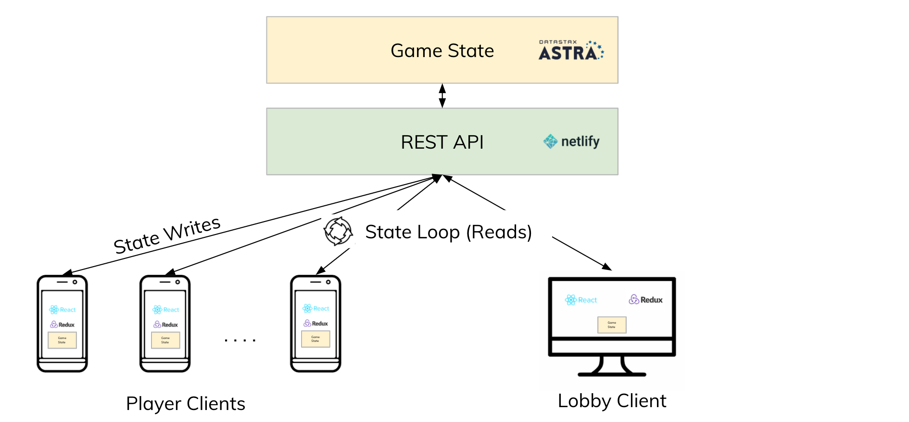
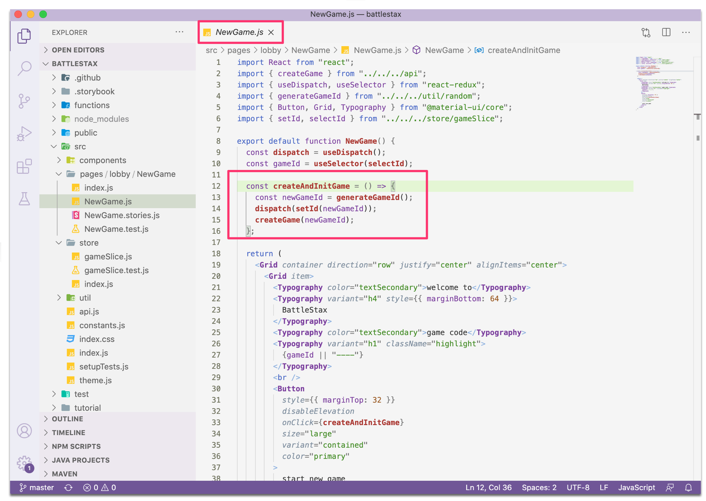
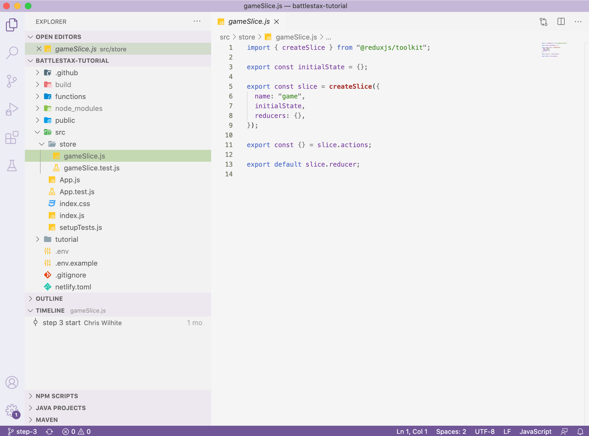

# 04. Test your client State

[](http://www.apache.org/licenses/LICENSE-2.0)
[](https://discord.com/widget?id=685554030159593522&theme=dark)
[](https://github.com/DataStax-Academy/battlestax/actions) 
[](https://app.netlify.com/sites/battlestax-tutorial/deploys)

[🏠 Back to [Table of Contents](./README.md#table-of-contents)]

* [Part1 - [Setup environment and tools](./README_step00.md)]
* [Part2 - [Create a REST API with netlify](./README_step01.md)]
* [Part3 - [Connect to ASTRA](./README_step02.md)]
* [Part34- [Create Client state](./README_step03.md)]

### Objectives
Redux Tool Kit (RTK) tremendously simplifies using Redux, elminating most of the issues most people have when using it (boilerplate code, etc). We will use RTK for state management on the Client and see how it is working with Astra. We will: 
* Build out the `gameSlice.js` boilerplate code by implementing one reducer, exporting an action, and creating a selector
* Build a test to try out the functionality of `gameSlice.js`

In this step we will be working with
/src/store -- 
/src/store/gameSlice.js -- 



### Section A) Creating slices with Redux Tool Kit

An application's state is divded into "slices" that are corresponding to each feature set of the application. 
Game state is saved in Astra and states writes go from the clients to the REST API (netlify)
Clients read state from the Astra database as well through the state loop
The Lobby and Player clients stay connected, as once the state is updated, it will be propogated to all the clients.

### Section B) Build a slice

In order to change the game state, there needs to be an initial event that triggers an _action_. In our case, this comes from the initiation of a new game, via the NewGame.js component.

Now to be able to set a game id as part of state, we will have to have a way to generate game id first. Lets first create a file called `src/constants.js`, that will provide some guideline to help our `generateGameId` to create random game ids. We wants our game codes to be 
* derived from the full Roman alphabet (ABCDE..)
* four characters in length

```
export default {
  GAME_ID_DICTIONARY: "ABCDEFGHIJKLMNOPQRSTUVWXYZ",
  GAME_ID_LENGTH: 4,
};
```

Now in a new `utils/random.js` file lets create out random game id generating function, `generateGameId`. We will first need to import `constants.js` as well as well as the lodash library

```
import _ from "lodash";
import constants from "../constants";
```
We can now build out the `generateGameId` function:

````
import _ from "lodash";
import constants from "../constants";

export const generateGameId = () =>
  _.sampleSize(constants.GAME_ID_DICTIONARY, constants.GAME_ID_LENGTH).join("");
````

The _.sampleSize() method is used to give an array of n random elements from the given array.
`_.sampleSize(array, n)`
The join() method creates and returns a new string by concatenating all of the elements in an array 
A string of 4 random letters is returned

Once the `createAndInitGame` function is called, a new game id is created, which is dispatched to the store to be used `setId` reducer in our gameSlice.js. Note the import of `setId` from `/store/gameSlice` at the top of the NewGame.js code,



The only is we have yet to add a reducer to `gameSlice`

Now that we have function that can generate a game code for use. Let's use the RTK to build out the game slice that will set the game code as part of the state. Redux Toolkit allows us to write shorter logic that's easier to read, while still following the same Redux behavior and data flow. Open the `src/store/gameSlice.js` file to see skeletal code we have provided to get you started.



Lets discuss some of the parameters in `createSlice`.

`initialState` - The initial state value for this slice of state.
`name` - A string name for this slice of state. Generated action type constants will use this as a prefix.
`reducers` - An object containing Redux "case reducer" functions (functions intended to handle a specific action type.)

[Go to Create your StoryBookUI -->](./README_step05.md)

